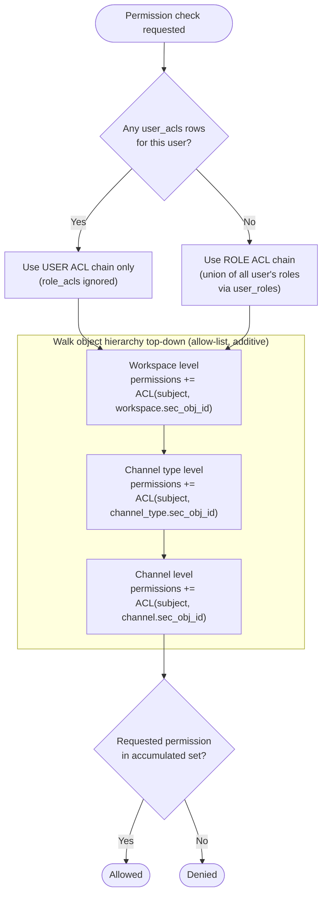

# Chatney RBAC & ACL

Chatney's authorization model combines Role-Based Access Control (RBAC) with per-object Access Control Lists (ACLs). Roles group permissions for reuse; ACLs bind those permissions (via roles, or directly per user) to specific secured objects.

## Core concepts

### Subjects
Subjects are the entities permissions can be granted to:

- **Users** (`users`) — a user holds one or more roles via `user_roles` (many-to-many). So **a user can hold multiple roles at once**.
- **Roles** (`roles`) — named collections of grants, reusable across users.

### Objects (secured objects)
Objects are the entities permissions are granted *on*. Every securable object carries a `sec_obj_id` foreign key pointing at a row in `secure_objects` — a generic registry table (`id`, `description jsonb`) that ACL rows attach to instead of attaching directly to domain tables.

The three securable object types, in hierarchical order:

1. **Workspaces** (`workspaces.sec_obj_id`)
2. **Channel types** (`channel_types.sec_obj_id`)
3. **Channels** (`channels.sec_obj_id`) — each channel belongs to one `channel_type_id` and one `workspace_id`

This hierarchy exists because workspaces contain channels, and every channel always belongs to exactly one channel type. So a permission check on a channel is really a check across all three levels.

### Permissions
Permissions are values of the Postgres enum `permission`, namespaced by domain, e.g.:

- `workspace.*` — createWorkspace, readWorkspace, updateWorkspace, deleteWorkspace
- `channel.*` — createChannel, readChannel, editChannel, deleteChannel, createMessage, readMessage, editMessage, deleteMessage, editOwnMessage, deleteOwnMessage, addChannelGroup, editChannelGroup, deleteChannelGroup, deleteChannelType
- `role.*` — createRole, editRole, deleteRole
- `user.*` — createUser, readUser, editUser, deleteUser
- `config.*` — readValue, updateValue
- `attachment.*` — upload, read, delete

### ACL tables
Two tables bind permissions to `(subject, secured object)` pairs, each storing a `permission[]` array:

- **`role_acls`** — `(role_id, sec_obj_id) -> permissions[]`. What a role can do on a given secured object.
- **`user_acls`** — `(user_id, sec_obj_id) -> permissions[]`. What a specific user can do on a given secured object, overriding role-based resolution for that object.

Both are keyed by the composite primary key `(subject_id, sec_obj_id)`, so there is at most one permissions array per subject/object pair.

## Permission resolution algorithm

To check whether a user has a given permission on a target object (workspace, channel type, or channel), the check walks the object hierarchy **top-down**: workspace -> channel type -> channel, stopping at whichever level the target object sits at.

### Step 1 — Determine ACL source: user or role
For the acting user, first check whether **any `user_acls` rows exist** for that user across the relevant secured objects in the hierarchy.

- If user ACL records exist, **role ACLs are ignored entirely** for this check — resolution uses only `user_acls`.
- If no user ACL records exist, resolution falls back to **role ACLs**, aggregated across all of the user's roles (all rows in `user_roles`).

This is an either/or switch per check — it is not a merge of user and role permissions. User ACL presence fully overrides the role ACL chain.

### Step 2 — Walk the hierarchy, accumulating permissions (allow-list)
Using whichever ACL source was selected in Step 1, permissions are collected additively across up to three levels, in order:

1. **Workspace level** — look up ACL permissions for the subject(s) on the workspace's `sec_obj_id`. Add any found permissions to the result set.
2. **Channel type level** — look up ACL permissions for the subject(s) on the channel type's `sec_obj_id`. Add any found permissions to the result set (union with what was already collected).
3. **Channel level** — look up ACL permissions for the subject(s) on the channel's `sec_obj_id`. Add any found permissions to the result set (union with what was already collected).

Each level only ever *adds* permissions — there is no override or negation between levels. This is a pure allow-list: the final permission set for the target object is the union of everything granted at the workspace, channel type, and channel levels. A permission granted at the workspace level therefore implicitly applies at every channel type and channel beneath it, and a permission granted at the channel type level applies to every channel of that type.

If the target object is a workspace, only step 1 applies. If it's a channel type, steps 1-2 apply. If it's a channel, all three steps apply.

### Step 3 — Authorize
The requested action's permission is checked for membership in the accumulated set. Present -> allowed; absent -> denied.

## Summary diagram

Note: the walk stops at whichever level the target object sits at — a workspace-level check only runs the Workspace step, a channel-type-level check runs Workspace -> Channel type, and a channel-level check runs all three.

## Key implementation notes

- `secure_objects` is a generic indirection table — domain tables don't store permissions directly, they hold a `sec_obj_id` pointer, keeping ACL storage/logic uniform across workspaces, channel types, and channels.
- `user_roles` is a pure many-to-many join (`user_id`, `role_id` composite PK) — this is what allows a user to hold multiple roles simultaneously. It is the only place a user-to-role relationship is stored; `users` has no direct role reference.
- All ACL/role/user foreign keys cascade on delete (`fk_user_acls_user_id`, `fk_role_acls_role_id`, `fk_user_roles_role_id`, `fk_user_roles_user_id`, `fk_*_sec_obj_id`), so deleting a user, role, or secured object cleans up its ACL rows automatically.
- Because resolution is additive/allow-list only, there is no explicit "deny" permission in the model — access is granted purely by presence of a permission somewhere in the resolved chain.
